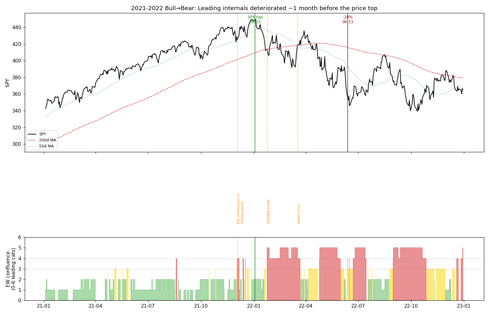

# 牛转熊判断标准 — 2021–2022 实证研究

**目标**：用 2021-01-01 ~ 2022-12-31 的市场数据，结合当时公开新闻，提炼"牛转熊"的判断标准，且尽量**提前**报警。

**数据**：yfinance 拉取的 2020–2022 日线（2020 用于热身 200 日均线）。晴雨表 SPY/QQQ/SOXX/IWM、宏观 VIX/HYG/LQD/TLT/^TNX/^IRX、11 个 SPDR 行业 ETF、约 100 只 pre-2021 大盘股做宽度篮子。脚本在 `scratchpad/`（fetch.py / analyze.py / confluence.py / chart.py）。

## 1. 基准事实（这轮顶在哪）

| 事件 | 日期 |
|---|---|
| 投机成长股/ARKK 见顶（结构性领先） | 2021-02 |
| 纳指综指见顶 | 2021-11-19 |
| **S&P 500 收盘历史顶** | **2022-01-03** (4796) |
| S&P 500 收盘跌破 -20%（熊市确认） | **2022-06-13** |

关键：**指数顶（1月）远晚于内部结构顶（去年春~秋）**。任何只看价格/均线的方法，注定在顶之后才报警。

## 2. 各指标"首次持续触发"相对指数顶的提前量

（每条要求连续 3 日成立，window=2021–2022）

| 指标 | 首触发 | 相对 SPX 顶 |
|---|---|---|
| 成长跑输 (QQQ/SPY 走弱) | 2021-02-24 | +313d |
| 半导体跑输 (SOXX/SPY) | 2021-03-05 | +304d |
| 防御板块抢筹 (XLU/XLP/XLV vs XLK/XLY/XLC) | 2021-03-26 | +283d |
| 信用走弱 (HYG/LQD) | 2021-05-06 | +242d |
| **宽度背离**（指数近高 + %>200日均线 大幅下滑） | **2021-09-15** | **+110d** |
| **HYG 跌破 200 日均线**（信用确认） | **2021-11-30** | **+34d** |
| **净新高转负**（新高股<新低股，5日均） | **2021-12-03** | **+31d** |
| 跌破 200 日均线 (T1) | 2022-01-27 | **顶后 24d** |
| 跌破 30 周线 | 2022-01-24 | 顶后 21d |
| %>200日 < 50% | 2022-02-22 | 顶后 50d |
| 死叉 (50<200) | 2022-03-18 | 顶后 74d |
| 200 日均线掉头向下 | 2022-05-11 | 顶后 128d |
| 收益率曲线倒挂 (10y-3m) | 2022-11-14 | 顶后 315d（对择时太晚） |

**两类指标泾渭分明**：
- **领先类（内部结构）**：领导力轮动 / 信用 / 宽度背离 / 净新高 — 在顶前数周~数月就坏了。
- **滞后类（价格趋势）**：200日均线、死叉、均线斜率 — 全部在顶**之后**才触发，是"确认/防守"信号，不是预警。

## 3. 单指标不可用 → 需要"领先项共振"

单条领先信号太早、噪声大：成长跑输 2021-02 就响，但指数又涨了一整年。解法是**对 6 个相互独立的领先类别做共振计数**（0–6）：

宽度背离 · 净新高转负 · 信用走弱(HYG/LQD 或 HYG<200日) · 防御抢筹 · 成长/半导体跑输 · VIX 体制上移。

| 共振阈值（连续5日） | 首次满足 | 相对顶 | 相对熊市确认 |
|---|---|---|---|
| ≥2 类 | 2021-03-18 | +291d | — （**假信号**：春季再通胀轮动，未恶化） |
| **≥3 类** | **2021-12-22** | **+12d** | **+173d (~6 个月)** |
| ≥4 类 | 2022-01-28 | 顶后 25d | +136d |

按周看更干净：**2021-12-03 当周共振直接冲到 5**（宽度背离+净新高转负+信用+防御+VIX 同时亮），此后整段熊市基本不掉下 3。

**2021 假信号检验**（共振≥3 的天数）：Q1=0、Q2=10、Q3=3、Q4=14。唯一值得警惕的假信号是 2021 Q2（再通胀+ARKK 回落），但它从未升到 ≥4 且自行消退——所以**"≥3 且持续，或一周内≥4"** 能把春季噪声滤掉，只在 12 月真正点火。

## 4. 与当时公开新闻的对照（为何 12 月初点火不是巧合）

- **2021 全年**：meme/ARKK/SPAC 投机见顶（2 月），成长股内部先熊；指数靠少数权重股扛着创新高——这正是"宽度背离"的来源。
- **2021-11-30**：鲍威尔宣布"是时候弃用 transitory（暂时性）"，并放风加快 taper。**货币体制转向**。
- **2021-12-15**：12 月 FOMC 点阵图给出 2022 年三次加息 + 加速缩债。
- → 市场内部（共振=5）与政策面在 **2021-12 第一周** 同时确认，比指数顶早约 1 个月。
- **2022-01-05**：FOMC 纪要偏鹰、提及 QT → 触发 1 月杀跌（指数顶后第一脚）。
- **2022-02-24**：俄乌战争 → 能源/通胀冲击。
- **2022-03-16 / 05-04 / 06-15**：加息 25 / 50 / 75bp。
- **2022-06-10**：5 月 CPI 8.6% 爆表 → 06-13 确认熊市。

## 5. 结论：分层"牛转熊"判据（为提前报警优化）

**第 0 层 · 留意（不动手）** — 任意单条领先信号亮（成长/半导体跑输、信用初弱）。太早，仅记录。

**第 1 层 · 预警 / 减仓（核心早警）** — **领先项共振 ≥3 类持续，或一周内 ≥4 类**。
本轮 2021-12 初触发：早于指数顶 ~1 个月，早于 -20% 熊市确认 ~6 个月。开始降低敞口、收紧止损、停止追高。

**第 2 层 · 防守 / 对冲（趋势确认）** — **收盘跌破 200 日均线 + 200 日均线掉头/死叉**。
本轮 2022-01 下旬~03 月。顶后才到，但仍早于 -20% 约 3–5 个月。转为防御、对冲、现金为王。

**一句话标准**：*牛转熊先死在"内部"（宽度/领导力/信用），后死在"价格"（均线）。把领先内部项做共振计数提前 1 个月报警，再用 200 日均线破位做防守确认——既抢到提前量，又用共振要求压住单指标的假信号。*

## 6. 跨周期稳健性回测（2018 / 2020 vs 2022）

同一套逻辑(`regime_lib.py`)在三段真实下跌 + 四段平静/假信号窗口上跑(`backtest.py` / `threshold.py`)，结论比"只拟合 2022"诚实得多。

**三段真实下跌的性质不同**：
- **2018 Q4**（Fed 加息+贸易战，较快的渐进顶，-19.8%）
- **2020 COVID**（外生冲击，33 天闪崩 -34%）
- **2022**（Fed 紧缩，慢熊 -23%）[基准]

### 阈值决策表（首次持续触发；想要：真跌段触发+对低点正提前量，假窗口不触发）

| 规则 | 2018Q4 (对低点) | 2020 (对低点) | 2022 (对低点) | 假信号 |
|---|---|---|---|---|
| 共振 ≥3 | +264d | +166d | **+173d** | **3 个**：2017-06、2018-04、2019-05 |
| 共振 ≥4 | +10d(太晚) | +17d(太晚) | **+136d** | 1 个：2019-06 |
| 共振 ≥5 | **漏报** | +3d(无用) | +110d | 0 个(全程干净) |
| **跌破 200 日线** | **+56d** | **+12d** | **+109d** | 0 个真假信号* |
| 共振≥4 **或** 破200线 | +56d | +20d | +137d | 0 个真假信号* |

\* 2019-01-02 的"触发"是窗口边缘伪影——2018 年底崩盘后价格年初仍在 200 线下，是旧信号的延续，非新的假信号。

### 三条硬结论

1. **领先共振早警是"过拟合 2022"的。** 2022 是慢熊、内部先烂、Fed 早早预告——正是宽度/信用/领导力背离的理想场景，所以提前一个月。换到 2018(更快、消息驱动)它**太晚**(≥4 触发时已到低点附近)，换到 2020(外生闪崩)**根本没有领先项先坏**。要让 2022 那种提前量，得把阈值降到 ≥3，而 ≥3 在 2017/2018/2019 反复假报警。降阈值=多假信号，升阈值(≥5)=漏报 2018、对 2020 无用。**没有一个共振阈值能同时在三段都既早又准。**

2. **外生冲击(2020)无法被任何内部恶化信号提前捕捉。** 闪崩前市场内部健康，一切信号都在崩盘**中**才亮。这是方法论的结构性盲区，只能靠常备对冲/仓位/止损,不能靠"信号"。

3. **真正稳健的脊梁是最朴素的 200 日均线破位 + 掉头。** 它在三段崩盘里**全部**先于低点触发且正提前量(+56/+12/+109 天)、平静年几乎无真假信号；代价是**永远晚于精确的顶**——这就是稳健性的价钱。

### 修正后的分层判据（经三周期验证）

- **主防守层(全天候，非选项)**：收盘持续跌破 200 日线 **且** 200 日线掉头 → 降敞口/对冲。三种 regime 都管用、不过拟合。
- **早减仓层(仅慢顶有效，加分项)**：领先共振 ≥4。在 2022 型慢熊里多抢 ~1 个月；明确接受它对快跌/外生崩盘无效、偶有 2019 式假信号——所以**只用来"减"，绝不单独作为唯一触发**。
- **尾部风险层(应对 2020 型)**：无早警信号，只能靠常备结构性对冲与仓位管理。

**一句话(修正版)**：把 200 日线破位+掉头作为全天候防守底线(稳健但滞后)，领先共振≥4 只在慢顶里当"提前减仓"的加分项(早但不稳健、且对外生冲击无效)。"既早又稳又全天候"的单一牛转熊信号并不存在——这正是回测要告诉我们的。

## 7. 局限

- **幸存者偏差(对 `--asof` 回测影响显著, 务必知道)**：`t_us_regime_monitor.py` 的宽度用【当下】的 S&P500∪NDX 成分股。回测早年时，2021-22 被打垮、已被剔出指数的弱票不在篮子里 → 历史宽度看起来偏健康(如 `--asof 2022-01-03` 实测 %>200日=77%、共振仅 2/6，显示 BULL)，**领先共振/宽度背离早警在历史回测里被系统性低估**。两点缓解：①【主防守层 200 日线破位+掉头是 SPY 自身、无幸存者偏差】，2018/2020/2022 回测里 DEFEND 都准确触发；②【live 前瞻运行用实时成分股，无此问题】。本文 §1-5 的早警提前量来自一个固定的 pre-2021 大盘篮子(同样有偏差但口径不同)，故与 live 工具的历史回测数值会有出入——结论方向一致, 精确数值以 live 前瞻为准。
- 阈值在三个周期上做了样本内/外对比，但样本仍少(3 段真跌)；纳入 2011、2015-16 等可进一步检验。
- XLC 2018-06 才上市，2018 H1 的领导力指标用可得行业 ETF 均值近似。
- 收益率曲线倒挂是衰退领先指标、对择时太慢，本框架未纳入择时层。

## 8. Overlay 回测：把状态机当调仓策略值多少钱（2026-07 补, 2015-01 → 2026-06）

工具：`t_us_regime_monitor.py --backtest 2015-01-01`（panel 建一次、逐日 classify，
与逐日 `--asof` 点位等价；报告 `result/us_regime_monitor/us_regime_backtest_*.txt`）。
口径：状态 t 日收盘可知 → 敞口 t+1 日生效，QQQ 载体，无交易成本。

### 8.1 11.5 年状态分布与关键段落

BULL 72% / CAUTION 14% / WATCH 3% / DEFEND 11%。关键事件全覆盖（2015-08 / 2016 初 /
2018-12 / 2020-03(WATCH 在闪崩中段点火) / 2022 主跌段 / 2025 春）——**作为"该不该防守"
的状态仪表是称职的**。

### 8.2 但作为机械调仓 overlay 不赚钱

| 变体 | 总收益 | CAGR | maxDD | vol | CAGR/vol |
|---|---|---|---|---|---|
| B&H QQQ | +645% | +19.2% | -35.1% | 21.9% | 0.87 |
| DEFEND-only | +328% | +13.5% | **-36.6%** | 19.5% | 0.69 |
| WATCH减半+DEFEND清仓 | +352% | +14.1% | -33.3% | 17.6% | 0.80 |
| 保守(CAUTION 也减) | +322% | +13.4% | -30.6% | 16.4% | 0.82 |

DEFEND 各段"躲掉 vs 错过"（段内 QQQ 涨跌）：
- 躲掉：**2022-08→11 的 -12.9%**（全程唯一大额兑现）、2016 初 -4.3%、2018-11 -1.1%
- 错过：**2019-01 的 +12.6%**（DEFEND 恰在 12-24 底部开始）、**2020-04~05 的 +26.0%**
  （底后两天进 DEFEND，整段 V 反弹在场外）、2022 夏 +14.3%（熊反，后随即回吐≈打平）、
  2025-05 +3.3%

### 8.3 结论：定价公平的保险，不是收益来源

- **趋势型退出结构性错过 V 型底反弹**（低点→重上 200 日线之间在场外）。样本里只有
  2022 一个值得躲的长熊，其余全是 V——所以 CAGR -5.7pp、maxDD 甚至没改善。
  这不是参数问题：退出已是价格回上 200 线即复位；要消掉空窗成本只能用对冲替代清仓。
- **风险转换近似等效率**：CAGR/vol 0.87 → 0.80-0.82，保守档把 vol 21.9→16.4、
  maxDD -35→-31——保费约 5-6pp 年化，买的是 2022 型长熊里少跌一半的权利。
  付不付是风险偏好决策，不是信号质量问题。
- 与本监控的既有定位一致：**backdrop 状态仪表，不进自动调仓**。§6 的"三段崩盘全部
  先于低点触发"说的是 trend_break 首触发；叠加 3 日持续 + 200 线掉头后，DEFEND
  状态在快跌里(2018-12/2020-03)实际起点已贴着低点——首触发早 ≠ 状态段能赚到。
- 注脚：WATCH 层历史触发被幸存者偏差系统性低估（§7），DEFEND-only 行无此偏差、
  最可信；无交易成本/滑点，真实数字更差一点。
